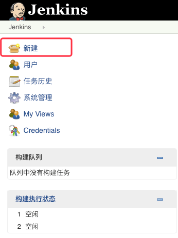

快速创建一个管道：

1. 复制下面的内容，并命名为`Jenkinsfile`，加入到版本控制的仓库中(托管服务像GitHub/Gogs/GitLab)，进行连接时，可能需要提供你在托管服务商那里注册的帐号和密码。
```
pipeline {
    agent any
    stages {
        stage('Build') {
            steps {
                sh 'echo "Hello World"'
                sh '''
                    echo "Multiline shell steps works too"
                    ls -lah
                '''
            }
        }
    }
}
```

2. 在`Jenkins`的`web UI`中点击**New Item**菜单。



3. 为新建的管道取一个名字（例如：**My Pipeline**），然后选择**Multibranch Pipeline**多分支管道。

4. 点击**Add Source**按钮，选择你使用的版本控制仓库类型，并填写一些详情信息。

5. 点击**Save**按钮，观察你的第一个管道的运行情况。

你可能需要对示例中的文本做一些修改以适配你自己的项目。在不同的系统上`sh`的类型不同，可能需要调整一下。

建立起自己的管道后，Jenkins会自动侦测到你的工作仓库中新分支创建和新推送请求的事件，并启动相应的管道任务。


# 示例

下面是对应多种语言的关于管道的简单示例,由于这里的管道定义了和`Docker`相关的任务，所以需要安装`Docker`。

## Java

```java
pipeline {
    agent { docker 'maven: 3.3.3 }
    stages {
        stage('build'){
            steps {
                sh 'mvn --version'
            }
        }
    }
}
```

## Node.js / JavaScript

```js
pipeline {
    agent { docker 'node: 6.3' }
    stages {
        stage('build') {
            steps {
                sh 'npm --version'
            }
        }
    }
}
```

## Ruby

```ruby
pipeline {
    agent { docker 'ruby' }
    stages {
        stage('build') {
            steps {
                sh 'ruby --version'
            }
        }
    }
}
```

## Python

```python
pipeline {
    agent { docker 'python: 3.5.1' }
    stages {
        stage('build'){
            steps {
                sh 'python --version'
            }
        }
    }
}
```

## PHP

```php
pipeline {
    agent { docker 'php' }
    stages {
        stage('build') {
            steps {
                sh 'php --version'
            }
        }
    }
}
```

